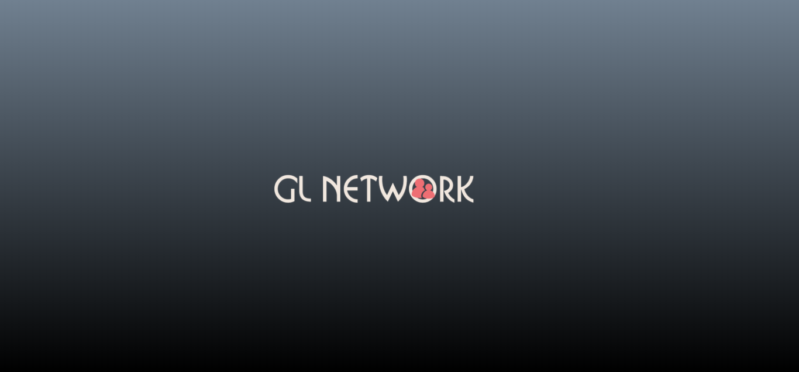
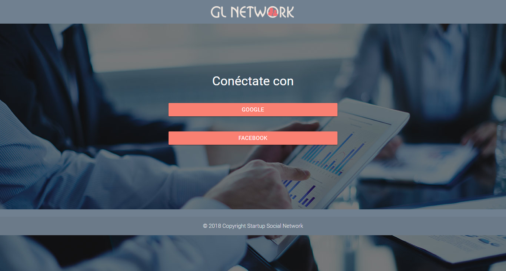
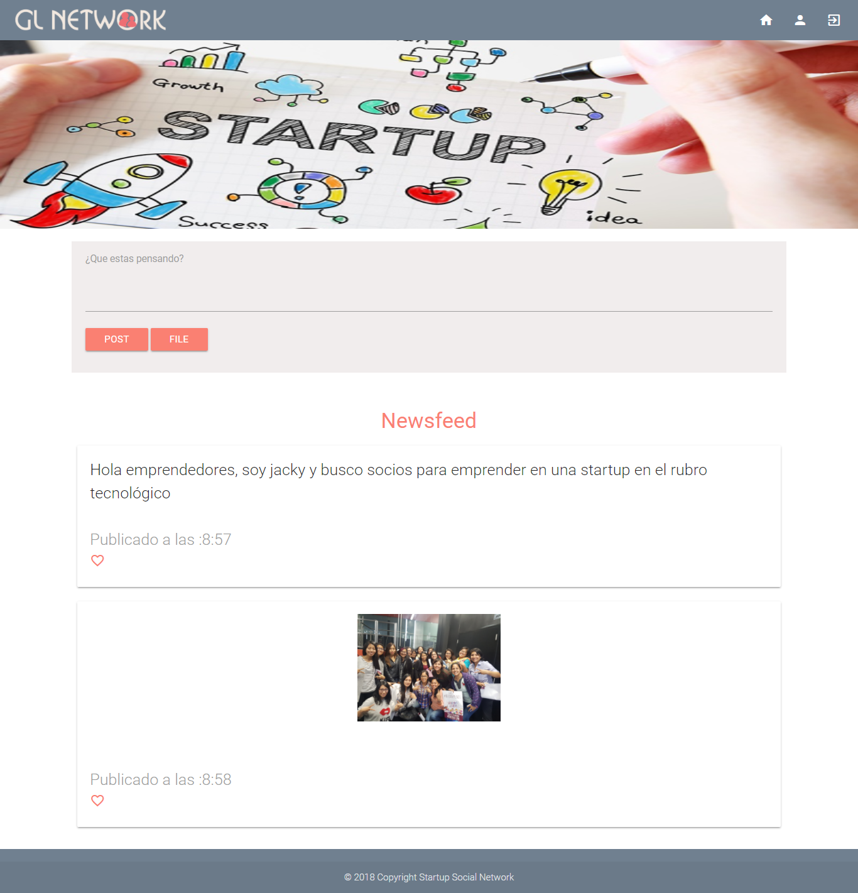
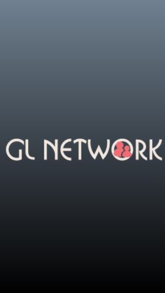
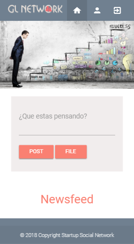
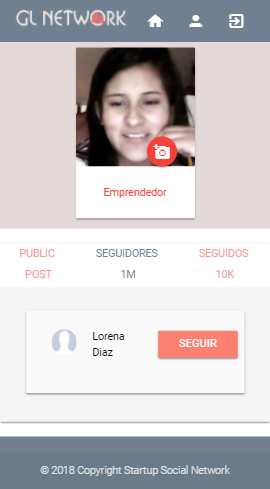
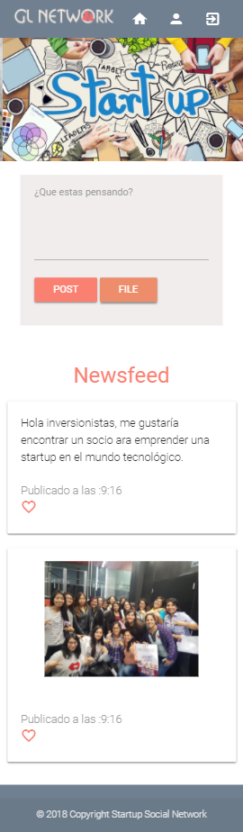

# GL NETWORK

* La red social que creamos busca hacer networking entre emprendedores e inversionistas, una red tan grande que podrá rápidamente poner en contacto emprendedores e inversionistas en un tiempo bastante corto y de manera bastante segura para que de esa manera puedan iniciar un negocio exitoso.

### Tecnologías que usamos

+ HTML 5
+ CSS 3
+ Framework- Materialize
+ jQuery
+ Firebase

# Vista en modo desktop

# Vista mobile

## Autores:
+ Laura Jimenez Hidalgo
+ Jackeline Gessenia Canales
